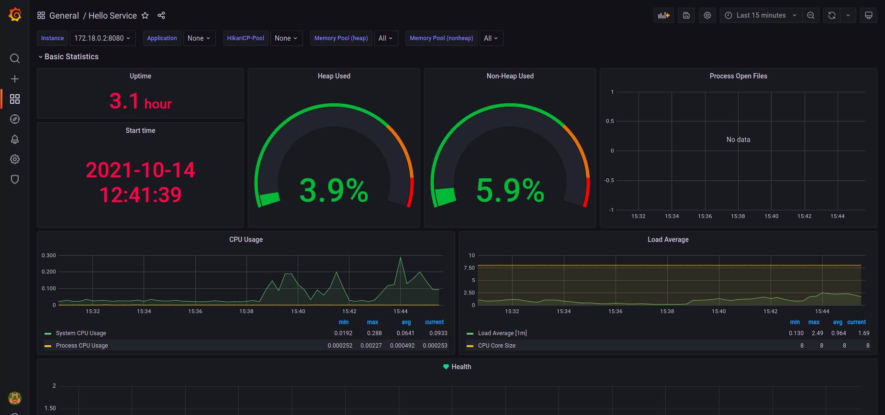

# Springboot-Prometheus-Grafana

Demonstrate the capabilities of monitoring a SpringBoot application with micrometer, Prometheus ad Grafana.

[PDF Version](readme.pdf)

## Features

* Micrometer
* Prometheus
* Grafana

## Usage

You will have to host prometheus, prometheus alert manager, Grafana as docker containers in your local environment. Please follow the guidelines on how you can spin up these instances.
### SpringBoot Hello World Demo

Feel free to clone this repo and spin up a springboot instance by running

```shell
docker build -t hello-world-demo .
```

Micrometer acts as an application metrics facade over number of monitoring implementations. Add the below dependency for prometheus.

```xml
		<dependency>
			<groupId>io.micrometer</groupId>
			<artifactId>micrometer-registry-prometheus</artifactId>
			<scope>runtime</scope>
		</dependency>
```
Annotate the rest controller hello api method with Timed Annotation helps to gather some statistics around the api invocations.

```java
@Timed(value = "hello-api", description = "Hello API")
```
Ensure a TimedAspect bean is configured to make the annotation works on arbitrary methods.

```java
  @Bean
  public TimedAspect timedAspect(MeterRegistry registry) {
    return new TimedAspect(registry);
  }
```

### Alert Manager

The docker compose yml file looks like below.

```yaml
  alertmanager:
    image: prom/alertmanager
    user: root
    privileged: true
    volumes:
      - /home/alertmanager.yml:/etc/alertmanager/alertmanager.yaml
    command:
      - '--config.file=/etc/alertmanager/alertmanager.yaml'
    ports:
      - '9093:9093'
```

We will take a look at how we populate the alert receiver configurations in alertmanager.yml to receive notifications in slack.

```yaml
global:
  # slack_api_url: '<api>'

route:
  receiver: 'slack'
  repeat_interval: 1m


receivers:
  - name: 'slack'
    slack_configs:
      - send_resolved: true
        username: 'Test User'
        channel: '#alerts'
        api_url: '<slack_webhook>'

```

### Prometheus

I recommend using docker-compose tool to provision the required containers, it's easy to manage your application stack. Read more [here](https://docs.docker.com/compose/) if you are new to docker compose.

```yaml
  prometheus:
    image: prom/prometheus
    user: root
    container_name: prometheus-latest
    volumes:
      - /home/prometheus.yml:/etc/prometheus/prometheus.yml
      - /home/alert.rules:/alertmanager/alert.rules
    command:
      - '--config.file=/etc/prometheus/prometheus.yml'
    ports:
      - 9090:9090
```

you need to bind the volume where you have kept the minimum set of configurations for prometheus to run.

```yaml
# my global config
global:
  scrape_interval:     15s # Set the scrape interval to every 15 seconds. Default is every 1 minute.
  evaluation_interval: 15s # Evaluate rules every 15 seconds. The default is every 1 minute.
  # scrape_timeout is set to the global default (10s).

# Load rules once and periodically evaluate them according to the global 'evaluation_interval'.
rule_files:
  - "/alertmanager/alert.rules"
  # - "second_rules.yml"

# A scrape configuration containing exactly one endpoint to scrape:
# Here it's Prometheus itself.
scrape_configs:
  # The job name is added as a label `job=<job_name>` to any timeseries scraped from this config.
  - job_name: 'prometheus'
    # metrics_path defaults to '/metrics'
    # scheme defaults to 'http'.
    static_configs:
    - targets: ['127.0.0.1:9090']

  - job_name: 'spring-actuator'
    metrics_path: '/actuator/prometheus'
    scrape_interval: 5s
    static_configs:
    - targets: ['<springboot_host>:8080']

alerting:
  alertmanagers:
    - static_configs:
        - targets: ['<alertmanager_host>:9093']

```

configure your springboot as a target to prometheus which enables to pull the metrics exposed in your application. Read more about the scrape configuration [here](https://prometheus.io/docs/prometheus/latest/configuration/configuration/).

Look at the alerting configuration where you point your alert manager instance and rules file section.

#### Alert Rule
```yaml
groups:
- name: springboot
  rules:

  # Alert for any instance that is unreachable for >1 minute.
    - alert: InstanceDown
      expr: up == 0
      for: 1m
      labels:
        severity: page
      annotations:
        summary: "Instance {{ $labels.instance }} down"
        description: "{{ $labels.instance }} of job {{ $labels.job }} has been down for more than 1 minute."

```

Navigate to the folder where you have placed your docker-compose.yml file. A sample is given below.
Run 
```shell
docker-compose up
```

which provisions your required containers.

```yaml
version: '2'
services:
  hello-world-demo:
    image: hello-world-demo
    container_name: hello-world-demo
    networks:
      private-subnet:
        ipv4_address: 172.18.0.2
  prometheus:
    image: prom/prometheus
    user: root
    container_name: prometheus-latest
    volumes:
      - /home/prometheus.yml:/etc/prometheus/prometheus.yml
      - /home/alert.rules:/alertmanager/alert.rules
    command:
      - '--config.file=/etc/prometheus/prometheus.yml'
    ports:
      - 9090:9090
    networks:
      private-subnet:
        ipv4_address: 172.18.0.3
  grafana:
    image: grafana/grafana
    container_name: grafana
    volumes:
      - /tmp:/tmp
    ports:
      - 3000:3000
    networks:
      private-subnet:
        ipv4_address: 172.18.0.8
  alertmanager:
    image: prom/alertmanager
    user: root
    privileged: true
    volumes:
      - /home/alertmanager.yml:/etc/alertmanager/alertmanager.yaml
    command:
      - '--config.file=/etc/alertmanager/alertmanager.yaml'
    ports:
      - '9093:9093'
    networks:
      private-subnet:
        ipv4_address: 172.18.0.4
networks:
  private-subnet:
    ipam:
      config:
        - subnet: 172.18.0.0/16

```
browse to <ip>:9090, prometheus should be up and running with the alert configurations.


You will see all the exposed metrics in prometheus which is crucial in monitoring your system.

now it's time to test our alert configuration. Try to stop your springboot container.

```shell
docker stop hello-world-demo
```

go back to prometheus alerting console and see the status.


check the Slack channel for the alert.


### Grafana

```yaml
  grafana:
    image: grafana/grafana
    container_name: grafana
    volumes:
      - /tmp:/tmp
    ports:
      - 3000:3000
```

Access your Grafana instance <ip>:3000/


Enable prometheus as a datasource.


Follow this [link](https://grafana.com/grafana/dashboards/6756) to import a sample springboot dashboard to your grafana instance.



you have the provision to configure alerts in grafana. Go to alerting, Notification Channels, New Channel, configure your Slack channel as destination.

Open any panel in the dashboard, create an alert rule something like below.


## Note

Feel free to reach out the writer <vipinev9@gmail.com> for any queries.